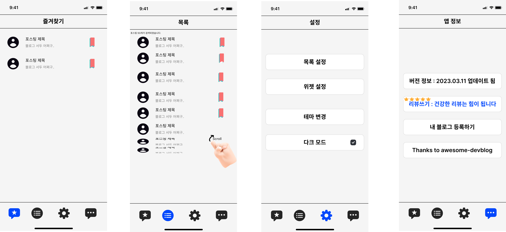

# 앱 이름 : 개발바닥  `(가칭)`

## 개발 목표 

- 처음부터 좋은 앱을 만들 순 없다. 우선 결과보다는 과정에 집중하자 
- 레이아웃은 항상 애플 HIG를 준수하자.
- 최초는 Core data로 로컬 데이터 베이스 연습

## 개발 기능

### 웹이랑 유사하게만 만들어도 선방 
- 현재 운영중인 ios 앱은 사용자가 임의로 조건 별로 보는게 불가능하고, 사람/회사/시사 카테고리 3개만 탭바로 페이지가 존재하고 표시 글 수도 20개정도?
- 탭바 내에서 여러 페이지로 찢는건 유지, 대신 데이터의 수 만큼 무한 스크롤 가능하도록 구현 한번에 
- 페이지 추가(부가적) : 애플 개발자 문서 이쁘게 번역해서 넣기
- 화면 위젯으로 블로그글 띄우기, 설정에서 카테고리/수 설정하기 : WidgetKit 학습 필요(SWIFTUI 기반). 아쉽게도 아직 위젯과 상호작용은 안됨..
- 플랫폼(폰,패드)별로 ui 고려사항이 다르므로 폴더를 분리하여 다르게 구현

## 상세 

### 화면별 기능

화면 1

  - [x] dataAsset의 json 정보 분류
  - [x] RSS 이용 네트워킹 및 XML 파싱 후 테이블 뷰 연동
  - [x] 상단 포스팅 카테고리 기준으로 데이터를 필터링할 수 있는 검색 바 구현
  - [x] 테이블 row 클릭시 해당 블로그 모바일 브라우저로 열기
  - [ ] 무색 별 클릭시 즐겨찾기에 등록 및 색이 있는 별로 변경 
  

화면 2

  - [ ] 즐겨찾기 등록된 포스팅 데이터 로컬 데이터베이스 저장
  - [ ] 앱 시작 시 로컬 데이터베이스 저장된 정보 로드 및 테이블 뷰 연동
  

화면 3

  - [x] 다크모드 토글 
  - [ ] <s>블로그 포스팅 검색 필터 설정 기능</s> `검색 바 구현으로 보류상태`
  - [ ] 위젯 구현 및 on/off 
  - [ ] 목록 화면 테마 테이블 뷰/ 컬렉션 뷰 전환 
  

화면 4

  - [ ] 현재 앱 스토어 배포 버전 표시 
  - [ ] 앱 스토어로 이동(리뷰 작성 요청)
  - [ ] 로컬 데이터베이스 접근 및 새 데이터 등록 
  - [ ] `도움주신 분들` 버튼 클릭시 모달 or 네비 뷰로 기여자가 적힌 뷰컨트롤러 이동, 해당 뷰컨트롤러 구현
  

### 기능 우선순위 : 초기 개발시 0순위 필수 구현, 이후 기간을 감안하여 최소 1순위까지 구현후 배포

#### 0 순위?? : 가장 기본적인 약속 정하기 어플의 틀, 어느 것 하나라도 없으면 정상 작동 안됨
#### 1 순위 : 사용자 입장에서 `이 정도는 당연히 있어야지`하는 그런 기능들
#### 2 순위 : 현재 상용되고 있는 앱에서 쓸만한 기능들
#### 3 순위 : 기존 상용 앱들에는 없지만 추가했을 때 좋은 효과가 있을 기능들

